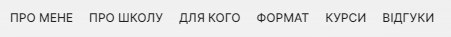
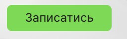

# AMBIDEXTER

If you want to improve the ability to improvise, create interesting scenarios,
interest and captivate the audience, learn not to lose balance in conflict
situations, then you need to come to us. We wish you success and we are very
glad that you will be able to use this resource

---

## Technologies Used

- Frontend

  - [Next.js 13](https://nextjs.org/)
  - [JavaSkript](https://uk.javascript.info/)
  - [TailwindCSS](https://tailwindcss.com/)
  - [Axios](https://axios-http.com/)
  - [React Hook Form](https://react-hook-form.com/)
  - [React-sckroll](https://www.npmjs.com/package/react-scroll)
  - [React responsive](https://www.npmjs.com/package/react-responsive)
  - [Swiper](https://swiperjs.com/)
  - [EsLint](https://eslint.org/)
  - [PropTypes](https://www.npmjs.com/package/prop-types)

- Backend
  - [Nodemailer](https://nodemailer.com/)
  - [Telegram API](https://core.telegram.org/)
  - [Json](https://docs.fileformat.com/uk/web/json/)

---

## Screenshots

## Use of the site

- The site is adapted for any devices
- You will easily choose the language of communication

  

- Сlicking on the link will take you to the desired section

  

- You can sign up for the first free training at any time convenient for you

  

- Feedback service with Telegram-bot

## Documentation

1. [How to run the project locally ](./READMY.start.md)
2. [localization ](./READMY.locale.md)
3. [Feedback Form ](./READMY.feedback_form.md)

Feedback Form

## Contacts

#### Web site

#### YouTube

